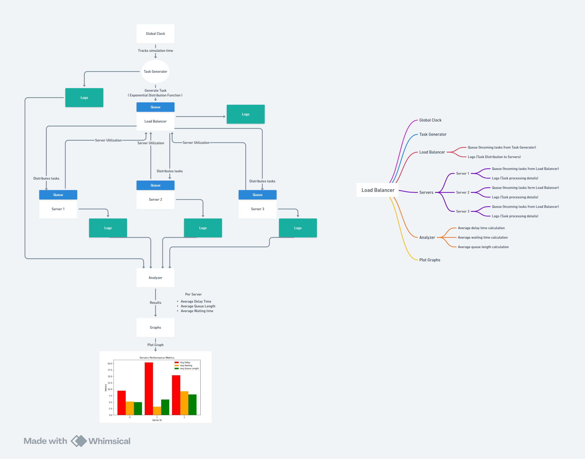

# Load-Balancer



## GlobalClock

`GlobalClock` is a C++ class designed to simulate the passage of time in a controlled and customizable manner. It allows for **parallel execution** with the main application logic, making it useful for various simulation scenarios.

### Features
- Adjustable **simulation** time increment (**speed**).
- Tracks both **simulation** time and **real** elapsed time.
- Runs in a separate thread to provide **parallel execution**.
- Simple interface to get the current simulation time, reset the clock, and set the clock speed.

### Usage
#### Creating an Instance
Instantiate the GlobalClock with an optional time increment parameter (default is 1.0).
```cpp
GlobalClock clock(100); // Custom time increment (speed)
```
***Adjust the speed** of the clock by this equation (simulation time (sec)= actual time (sec) * speed)*
#### Getting Current Time
Get the current simulation time using the getCurrentTime() method.
```cpp
double simTime = clock.getCurrentTime();
```
#### Resetting the Clock
Reset the simulation time to zero.
```cpp
clock.reset();
```
#### Getting Real Elapsed Time
Get the real elapsed time since the simulation started.
```cpp
double realElapsedTime = clock.getRealElapsedTime();
```

## LoadBalancer 
`LoadBalancer` is a C++ class designed to efficiently distribute tasks across multiple servers by tracking their utilization and assigning tasks to the least utilized server. It logs task assignments to a file for auditing and monitoring purposes. 
### Features 
- **Track Server Utilization**: Keeps track of each server's utilization. 
- **Task Queue**: Maintains a queue of tasks to be processed. 
- **Task Assignment**: Sends tasks to the server with the lowest utilization. 
- **Logging**: Logs task assignments, including server ID and current utilization.

### Usage

#### Creating an Instance
Instantiate the LoadBalancer class.
```cpp
LoadBalancer lb;
```
#### Tracking Server Utilization
Track the utilization of a server using the trackUtil method.
```cpp
lb.trackUtil(serverId, utilization);
```
*Should be sent from the server*
#### Sending Tasks
Send tasks to the load balancer using the sendTask method. Tasks should be defined using the Task struct.
```cpp
Task task = {id, time};
lb.sendTask(task);
```
#### Checking Pending Tasks
Check if there are any pending tasks in the queue.
```cpp
bool pending = lb.hasPendingTasks();
```

## Analyzer
The `Analyzer` module provides a set of helper functions and an analyzer function to process server log files , task generator log file and calculate performance metrics such as average delay time, average waiting time, and average queue length.

### analyzer
Analyzes server log files and the task generator log file to calculate and save performance metrics.

- **Parameters:**
  - `serverLogFiles`: A vector containing paths to server log files.
  - `taskGeneratorLogFile`: Path to the task generator log file.

### Usage
To use the `Analyzer` module, include the header file in your project and call the `analyzer` function with appropriate arguments.

```cpp
#include "Analyzer.h"

int main() {
    vector<string> serverLogs = {"server1.log", "server2.log"};
    string taskGenLog = "taskGenerator.log";

    analyzer(serverLogs, taskGenLog);

    return 0;
}
```
#### Example
Below are examples of server log, task generator log, and analysis results:
#### Server Log
```txt
Task ID: 1 Task Finished Time: 3.09
Task ID: 2 Task Finished Time: 18.44
Average Waiting Time: 4.2
Average Queue Length: 5
```
#### Task Generator Log
```txt
[Time: 0.90] Task ID: 1, Service Time: 2.19 seconds
[Time: 1.80] Task ID: 2, Service Time: 14.64 seconds
```
#### Analysis Results
```txt
Server ID: 0, Average Delay time: 9.415, Average Waiting time: 4.2, Average Queue length: 5
```
Here’s a **ServerQueue** documentation similar in style to the LoadBalancer example in your README:

---

# ServerQueue

`ServerQueue` is a C++ class that simulates a server with a fixed processing power and queue size. It processes tasks in parallel and maintains performance metrics like average wait time and queue occupancy. The server integrates with a global clock for time synchronization and supports utilization reporting for efficient task distribution.

## Features

- **Task Queue Management**: Handles tasks with a fixed queue size.
- **Parallel Processing**: Processes tasks in a separate thread for asynchronous operations.
- **Performance Metrics**: Calculates average wait time and average queue occupancy.
- **Utilization Reporting**: Reports server utilization for integration with load balancers.
- **Logging**: Logs task details and performance metrics to a file and terminal.

---

## Usage

### Creating an Instance

Instantiate the `ServerQueue` with a unique server ID, processing power, queue size, and a global clock.

```cpp
#include "Clock.h"
#include "SERVERQUEUE.h"

// Example usage
Clock globalClock;

ServerQueue serverQueue1(
    1,               // Server ID
    50.0,            // Processing power (1-100)
    20,              // Fixed queue size
    &globalClock,    // Pointer to the global clock
    [](std::pair<int, double> utilizationData) {
        // Utilization callback logic
    });
```

### Adding Tasks

Add tasks to the server queue using the `addTask` method.

```cpp
serverQueue1.addTask(1, 2.0); // Task ID 1, Service Time 2.0 seconds
```

### Processing Tasks

Tasks are processed automatically in a separate thread. Ensure the global clock is active for time synchronization.

---

### Calculating Metrics

#### Average Wait Time

Calculate the average time tasks waited in the queue before processing.

```cpp
serverQueue1.calculateAverageWaitTime();
```

#### Average Queue Occupancy

Calculate the average queue size during the simulation.

```cpp
serverQueue1.calculateAverageQueueOccupancy();
```

---

### Stopping Processing

Stop the server's task processing thread safely.

```cpp
serverQueue1.stopProcessing();
```

---

### Example

```cpp
#include "Clock.h"
#include "SERVERQUEUE.h"

int main() {
    Clock globalClock;
    ServerQueue serverQueue1(1, 50.0, 20, &globalClock, [](std::pair<int, double> utilizationData) {
        int serverID = utilizationData.first;
        double utilization = utilizationData.second;
        std::cout << "Server " << serverID << " utilization: " << utilization * 100 << "%" << std::endl;
    });

    serverQueue1.addTask(1, 3.0); // Add task with 3 seconds service time
    serverQueue1.addTask(2, 1.5); // Add another task

    std::this_thread::sleep_for(std::chrono::seconds(10)); // Let the server process tasks

    serverQueue1.calculateAverageWaitTime();
    serverQueue1.calculateAverageQueueOccupancy();

    serverQueue1.stopProcessing(); // Stop processing
    return 0;
}
```

---

### Logging and Utilization Reporting

Logs task details, queue updates, and performance metrics to the terminal and a file (`server<ID>_log.txt`).

Utilization reporting is achieved via a callback function:

```cpp
[](std::pair<int, double> utilizationData) {
    int serverID = utilizationData.first;
    double utilization = utilizationData.second;
    std::cout << "Server " << serverID << " utilization: " << utilization * 100 << "%" << std::endl;
}
```
Below is an example of how the output could look based on your `SERVERQUEUE.h` implementation and the provided usage code. 

### Example Output

#### Real-time Logs:
```plaintext
Server 1 added task 1 with service time: 2.0 at time: 0.0 secs.
Server 1 current task queue size: 0
Server 1 is processing task 1 with service time: 2.0 seconds, waited: 0.0 seconds at time: 0.0 secs.
Server 1 utilization updated: 10.0%.
TaskID: 1 Task Finished Time: 2.0 secs.

Server 2 added task 2 with service time: 3.0 at time: 0.0 secs.
Server 2 current task queue size: 0
Server 2 is processing task 2 with service time: 3.0 seconds, waited: 0.0 seconds at time: 0.0 secs.
Server 2 utilization updated: 12.0%.
TaskID: 2 Task Finished Time: 3.0 secs.

Server 3 added task 3 with service time: 1.5 at time: 0.0 secs.
Server 3 current task queue size: 0
Server 3 is processing task 3 with service time: 1.5 seconds, waited: 0.0 seconds at time: 0.0 secs.
Server 3 utilization updated: 15.0%.
TaskID: 3 Task Finished Time: 1.5 secs.

Server 1 added task 4 with service time: 4.0 at time: 2.0 secs.
Server 1 current task queue size: 0
Server 1 is processing task 4 with service time: 4.0 seconds, waited: 0.0 seconds at time: 2.0 secs.
Server 1 utilization updated: 20.0%.
TaskID: 4 Task Finished Time: 6.0 secs.

Server 2 added task 5 with service time: 6.0 at time: 3.0 secs.
Server 2 current task queue size: 0
Server 2 is processing task 5 with service time: 6.0 seconds, waited: 0.0 seconds at time: 3.0 secs.
Server 2 utilization updated: 24.0%.
TaskID: 5 Task Finished Time: 9.0 secs.

Server 3 added task 6 with service time: 8.5 at time: 1.5 secs.
Server 3 current task queue size: 0
Server 3 is processing task 6 with service time: 8.5 seconds, waited: 0.0 seconds at time: 1.5 secs.
Server 3 utilization updated: 28.33%.
TaskID: 6 Task Finished Time: 10.0 secs.
```

#### Statistics:
```plaintext
Server 1 Average Waiting Time: 0.0 seconds.
Server 1 Average Queue Length: 0 tasks.

Server 2 Average Waiting Time: 0.0 seconds.
Server 2 Average Queue Length: 0 tasks.

Server 3 Average Waiting Time: 0.0 seconds.
Server 3 Average Queue Length: 0 tasks.
```

#### Log Files:
- **server1_log.txt**:
```plaintext
Server 1 added task 1 with service time: 2.0 at time: 0.0 secs.
Server 1 current task queue size: 0
Server 1 is processing task 1 with service time: 2.0 seconds, waited: 0.0 seconds at time: 0.0 secs.
TaskID: 1 Task Finished Time: 2.0 secs.

Server 1 added task 4 with service time: 4.0 at time: 2.0 secs.
Server 1 current task queue size: 0
Server 1 is processing task 4 with service time: 4.0 seconds, waited: 0.0 seconds at time: 2.0 secs.
TaskID: 4 Task Finished Time: 6.0 secs.

Server 1 Average Waiting Time: 0.0 seconds.
Server 1 Average Queue Length: 0 tasks.
```

- **server2_log.txt**:
```plaintext
Server 2 added task 2 with service time: 3.0 at time: 0.0 secs.
Server 2 current task queue size: 0
Server 2 is processing task 2 with service time: 3.0 seconds, waited: 0.0 seconds at time: 0.0 secs.
TaskID: 2 Task Finished Time: 3.0 secs.

Server 2 added task 5 with service time: 6.0 at time: 3.0 secs.
Server 2 current task queue size: 0
Server 2 is processing task 5 with service time: 6.0 seconds, waited: 0.0 seconds at time: 3.0 secs.
TaskID: 5 Task Finished Time: 9.0 secs.

Server 2 Average Waiting Time: 0.0 seconds.
Server 2 Average Queue Length: 0 tasks.
```

- **server3_log.txt**:
```plaintext
Server 3 added task 3 with service time: 1.5 at time: 0.0 secs.
Server 3 current task queue size: 0
Server 3 is processing task 3 with service time: 1.5 seconds, waited: 0.0 seconds at time: 0.0 secs.
TaskID: 3 Task Finished Time: 1.5 secs.

Server 3 added task 6 with service time: 8.5 at time: 1.5 secs.
Server 3 current task queue size: 0
Server 3 is processing task 6 with service time: 8.5 seconds, waited: 0.0 seconds at time: 1.5 secs.
TaskID: 6 Task Finished Time: 10.0 secs.

Server 3 Average Waiting Time: 0.0 seconds.
Server 3 Average Queue Length: 0 tasks.
```

# TaskGenerator

TaskGenerator is a C++ class designed to generate tasks with random service times following an exponential distribution. It can operate in a separate thread to provide parallel execution and supports logging task details with timestamps.

## Features

- **Exponential Distribution**: Service times are generated using an exponential distribution with a configurable mean.
- **Threaded Operation**: Runs in a separate thread to generate tasks periodically.
- **Task Logging**: Logs task details, including service time and timestamp, to a file.
- **Global Clock Integration**: Synchronizes task timestamps with a global clock.
- **Callback Mechanism**: Supports sending generated tasks to a callback function for further processing.

## Usage

### Creating an Instance

Instantiate the TaskGenerator with the average service time, log file path, and a pointer to the global clock.

```cpp
#include "TaskGenerator.h"

std::atomic<double> globalClock(0.0);
TaskGenerator taskGen(42.0, "task_log.txt", &globalClock);
```

### Starting Task Generation

Start the task generator with a specified inter-arrival time (in seconds) and a callback function to handle generated tasks.

```cpp
taskGen.start(1.0, [](std::pair<int, double> task) {
    std::cout << "Generated Task ID: " << task.first
              << ", Service Time: " << task.second << " seconds" << std::endl;
});
```

### Stopping Task Generation

Stop the task generator thread when tasks are no longer needed.

```cpp
taskGen.stop();
```

### Generating a Single Task

Manually generate a single task using the `generateTask` method.

```cpp
std::pair<int, double> task = taskGen.generateTask();
std::cout << "Generated Task ID: " << task.first
          << ", Service Time: " << task.second << " seconds" << std::endl;
```

### Accessing the Last Generated Task

Retrieve the last generated task using the `getLastGeneratedTask` method.

```cpp
std::pair<int, double> lastTask = taskGen.getLastGeneratedTask();
```

## Example

Below is a complete example demonstrating the integration of TaskGenerator with a LoadBalancer:

```cpp
#include <iostream>
#include <queue>
#include <atomic>
#include <thread>
#include <chrono>
#include "TaskGenerator.h"

std::atomic<double> globalClock(0.0);

void globalClockFunction() {
    while (true) {
        std::this_thread::sleep_for(std::chrono::milliseconds(100));
        globalClock += 0.1;
    }
}

class LoadBalancer {
public:
    void addTask(const std::pair<int, double>& task) {
        taskQueue.push(task);
        std::cout << "Task added to LoadBalancer - ID: " << task.first
                  << ", Service Time: " << task.second << " seconds\n";
    }

private:
    std::queue<std::pair<int, double>> taskQueue;
};

int main() {
    std::thread clockThread(globalClockFunction);

    LoadBalancer loadBalancer;
    TaskGenerator taskGen(42.0, "task_log.txt", &globalClock);

    taskGen.start(1.0, [&loadBalancer](std::pair<int, double> task) {
        loadBalancer.addTask(task);
    });

    std::this_thread::sleep_for(std::chrono::seconds(10));
    taskGen.stop();
    clockThread.detach();

    return 0;
}
```

## Example Output

Below is a sample output from the log file:

```
[Time: 0.90] Task ID: 1, Service Time: 2.19 seconds
[Time: 1.80] Task ID: 2, Service Time: 14.64 seconds
[Time: 2.70] Task ID: 3, Service Time: 5.32 seconds
```

## Key Considerations

- Ensure the global clock is running before starting the TaskGenerator.
- Properly handle the lifecycle of threads to avoid resource leaks.
- Use an appropriate inter-arrival time to match the desired task generation rate.
- Always validate the log file path to prevent runtime errors.


